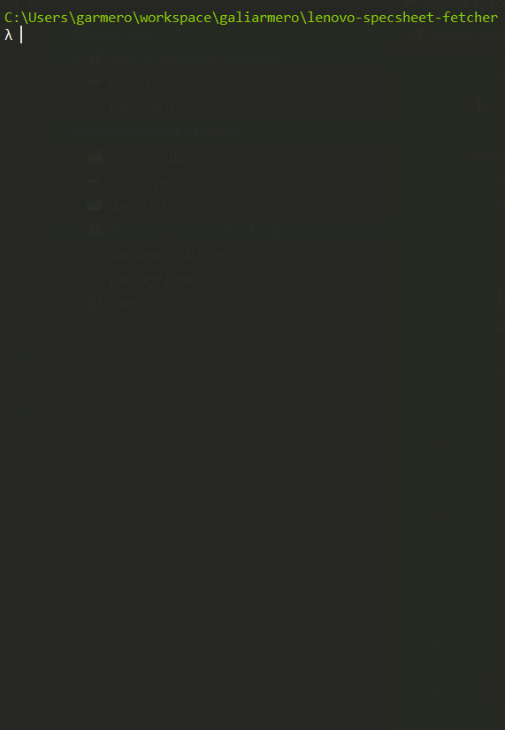

# lenovo-specsheet-fetcher
Find the specsheets for one or more Lenovo laptop models

## About

This tool scrapes and aggregates specsheets for multiple Lenovo laptop models which can be used as basis for comparison or purchase decisions. It uses Lenovo's handy [PSREF](https://psref.lenovo.com/) tool.


## Usage

1. Populate `config.yml` with a) the models (Machine Type and Model or MTM) and b) the fields to be included in the specsheet
  ```yml
  models:
    - 81U40056PH
    - 81TD000XPH
    - 81RS002APH
    ...
  fields:
    - "Model"
    - "Product"
    - "Processor"
    - "Graphics"
    - "Memory"
    - "Storage"
    - "Display"
    - "Color"
  ```

2. Execute the script
  ```bash
  node lenovo-specsheet-fetcher.js
  ```

  

The script generates `specs.csv` containing the aggregated specs.

